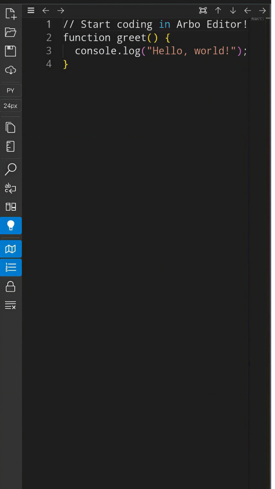

<p align="center">
  
</p>

# Arbo Editor

# Arbo Editor

[](https://opensource.org/licenses/MIT)
[](https://github.com/mallikmusaddiq1/arbo-editor/actions)
[](https://github.com/mallikmusaddiq1/arbo-editor/commits/main)
[](https://github.com/mallikmusaddiq1/arbo-editor/)
[](https://github.com/mallikmusaddiq1/arbo-editor/releases)

---

## 🚀 Overview

Arbo Editor is a modern, in-browser code editor built with the **Monaco Editor**, the same powerful engine that powers VS Code. It offers a rich set of features for developers, including **syntax highlighting** for a wide range of languages, **real-time error checking**, **word wrap**, **minimap**, **line numbers**, and essential code editing functionalities like undo/redo, copy/paste, and find/replace.

Designed for convenience, Arbo Editor supports **Progressive Web App (PWA)** features for offline use and quick access, along with seamless saving to browser cache and file download capabilities. Its intuitive interface and responsive design make it a versatile tool for quick code edits, learning, and prototyping directly in your web browser.

<p align="center">
  
  <br>
  <em>A glimpse of Arbo Editor in action.</em>
</p>

---

## ✨ Features

* **Monaco Editor Integration**: Leverages the powerful core of VS Code for a familiar and robust editing experience.
* **Multi-Language Support**: Provides syntax highlighting and basic features for over 30 programming languages (e.g., JavaScript, TypeScript, HTML, CSS, Python, Java, C#, PHP, Markdown, SQL, etc.).
* **Real-time Error Checking**: Offers instant feedback on code errors and warnings for supported languages, helping you catch issues as you type.
* **Customizable Interface**: Personalize your coding environment by toggling themes (**light/dark**), adjusting **font size**, enabling/disabling **word wrap**, **minimap**, and **line numbers**.
* **Essential Editing Tools**: Includes core functionalities like **undo/redo**, **copy all content**, intelligent **code formatting** (for supported languages), a built-in **find/replace** dialog, and a custom right-click context menu for quick actions.
* **Robust File Operations**:
    * **New File**: Quickly start with a clean slate.
    * **Open File**: Load code directly from your local system. The editor attempts to auto-detect the language based on the file extension.
    * **Save to Cache**: Automatically and manually saves your current work to the browser's local cache, ensuring your code persists even if you close the tab or go offline.
    * **Download Code**: Export your code as a file to your local machine with a user-defined filename.
* **Diff View**: Easily compare your current code with a previously saved or original version, making it simple to track changes.
* **Read-Only Mode**: Toggle this mode to prevent accidental modifications to your code.
* **Responsive Design**: The UI is optimized to provide a great experience across various screen sizes, from large desktops to small mobile devices, using adaptive scaling.
* **PWA Support**: Install Arbo Editor directly to your device's home screen for an app-like experience, including offline access.

---

## 🛠️ Setup and Installation

### Local Development

1.  **Clone the repository:**
    ```bash
    git clone [https://github.com/mallikmusaddiq1/arbo-editor.git](https://github.com/mallikmusaddiq1/arbo-editor.git)
    cd arbo-editor
    ```
2.  **Serve the files:** Due to browser security restrictions (CORS, service worker registration), you can't just open `index.html` directly from your file system. You'll need a local web server. Here are a few easy ways:

    * **Python's Simple HTTP Server (Recommended for simplicity):**
        If you have Python installed, navigate to your `arbo-editor` directory in the terminal and run:
        ```bash
        python -m http.server 8000
        ```
        Then open `http://localhost:8000` in your web browser.

    * **Node.js `serve` package:**
        If you have Node.js and npm installed:
        ```bash
        npm install -g serve
        # Navigate to your arbo-editor directory
        serve .
        ```
        Then open the URL (usually `http://localhost:3000`) provided in your terminal.

### PWA Installation

Once you serve the application using a local server (or deploy it to a web server), modern browsers will automatically detect the PWA capabilities defined in your `manifest.json`. Look for an "Install" button in your browser's address bar or a menu option (e.g., "Add to Home screen" on Android, "Install Arbo Editor" on desktop Chrome, or similar options in Firefox/Safari). This will allow you to install Arbo Editor as a standalone application on your device.

---

## 🤝 Contributing

We heartily welcome contributions to make Arbo Editor even better! Whether you're fixing a bug, adding a new feature, or improving documentation, your help is invaluable.

Please follow these steps to contribute:

1.  **Fork the Repository:** Start by forking the [Arbo Editor repository](https://github.com/mallikmusaddiq1/arbo-editor) to your own GitHub account.
2.  **Clone Your Fork:** Clone your forked repository to your local machine.
    ```bash
    git clone [https://github.com/mallikmusaddiq1/arbo-editor.git](https://github.com/mallikmusaddiq1/arbo-editor.git)
    cd arbo-editor
    ```
3.  **Create a New Branch:** Before making any changes, create a new branch for your feature or bug fix. Use descriptive names like `feature/add-dark-theme` or `bugfix/fix-file-save`.
    ```bash
    git checkout -b feature/your-feature-name
    ```
4.  **Make Your Changes:** Implement your changes and ensure they are thoroughly tested.
5.  **Commit Your Changes:** Commit your changes with a clear, concise, and descriptive commit message. A good commit message explains *what* you changed and *why*.
    ```bash
    git commit -m 'feat: Implement new code formatting functionality'
    # Example for a bug fix:
    # git commit -m 'fix: Resolve issue where word wrap was not persisting'
    ```
6.  **Push to Your Fork:** Push your new branch with your committed changes to your forked repository on GitHub.
    ```bash
    git push origin feature/your-feature-name
    ```
7.  **Open a Pull Request (PR):** Go to the original [Arbo Editor repository](https://github.com/mallikmusaddiq1/arbo-editor) on GitHub. You should see a prompt to open a Pull Request from your new branch. Fill out the PR template, providing a detailed explanation of your changes, any relevant screenshots, and reference to any issues your PR resolves.

We appreciate your efforts to improve Arbo Editor!

---

## 📄 License

This project is open source and available under the **MIT License**. See the `LICENSE` file in the repository for more details.

---

## 📧 Contact

**Author:** Mallik Mohammad Musaddiq
**Email:** [mallikmusaddiq1@gmail.com](mailto:mallikmusaddiq1@gmail.com)

**GitHub Repository:** [https://github.com/mallikmusaddiq1/arbo-editor](https://github.com/mallikmusaddiq1/arbo-editor)

---